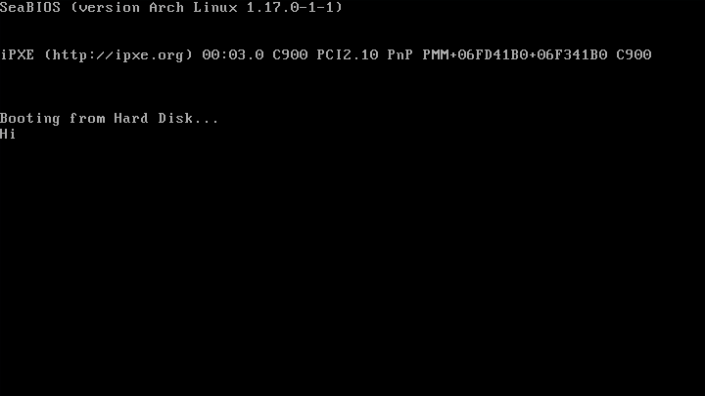

# FeASM

**FeASM** is a program written in Python3 that converts x86 machine code bits to a BIOS-compliant boot sector.

This is entirely a **gimmick!** I strongly discouraged utilizing **FeASM** for any serious or production projects.

## Usage

### Obtaining source

- Install dependencies: [Git](https://git-scm.com/downloads), [Python3](https://www.python.org/downloads/)
- Clone the repository: `git clone https://github.com/FeltMacaroon389/FeASM`
- Move into the cloned directory: `cd FeASM`

### Writing code

- Create or edit a text file containing your **x86** instructions as bits (0's and 1's).
- Any line starting with a `#` will be ignored as a comment.
- `machine_code.txt` contains an example program, which displays `Hi` to the screen using the BIOS.
- Check out the [Intel© 64 and IA-32 Architecture Software Developer Manuals](https://www.intel.com/content/www/us/en/developer/articles/technical/intel-sdm.html) for references.

- Execute `FeASM.py`
    - Pass your input machine code file in the first argument
    - Pass the output binary name in the second argument

- Example command: `python3 FeASM.py machine_code.txt boot.bin`
    - This will assemble the machine code in `machine_code.txt` and output the assembled binary boot sector in `boot.bin`

## License

**FeASM** is licensed under the **MIT License**. A copy of this license can be found at `LICENSE`

